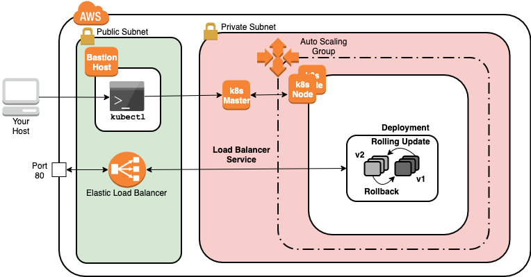

Lab Environment
---------------

You will use a multi-node Kubernetes cluster to explore Kubernetes deployments for managing pods in this lab. This lab provides you with a Kubernetes cluster initialized with kubeadm and running on Ubuntu. The cluster is similar to the clusters used in official CNCF Kubernetes certification exams. It has a bastion node for connecting to the Kubernetes cluster nodes that includes a single control-plane node. The infrastructure is deployed on AWS.

1. Click Open Development Env. once you see 100% Setup completed

2. At the login prompt enter the following credentials:
```
login: Enter ca
Password: Press enter (no password)
```

3. Once you see Open Environment 100% Setup completed. Copy the Cluster SSH command that appears at the bottom of the lab Credentials panel:

```
ssh ubuntu@54.244.58.164 -oStrictHostKeyChecking=no
```

4. In the browser terminal, enter the Cluster SSH command at the prompt

5. To ensure the cluster has one available worker node (ROLES set to <none>) before proceeding to use the cluster, enter the following command to watch the cluster come up and press ctrl+c to stop watching:

```
watch kubectl get nodes
```

Managing Pods with Deployments
------------------------------

Effectively using Pods requires higher-level abstractions. For example. something to control multiple Pods as a single unit to facilitate high availability and fault tolerance if a Kubernetes worker node were to go offline. Kubernetes Deployments are one such higher-level resource that can manage Pods. Some key traits of Deployments are:

- Declare a desired state for your Pods, and Deployments will do the work to bring your cluster to the desired state
- Configurable rolling update behavior to control how many Pods in a Deployment are updated
- State tracking to facilitate rolling back to previous versions

A Deployment controller constantly monitors the desired state of the Deployment and the state of the Kubernetes cluster and reconciles the cluster state with the desired state you provide the Deployment. These benefits are why you rarely want to deploy individual Pod resources.

1. Create a Namespace for the resources you will create in this lab step, and change your default kubectl context to use the Namespace:

```
# Create namespace
kubectl create namespace deployment
# Set namespace as the default for the current context
kubectl config set-context $(kubectl config current-context) --namespace=deployment
```

2. Use the kubectl create command to generate a Deployment manifest for you:

```
kubectl create deployment --image=httpd:2.4.38 web-server --dry-run=client -o yaml
```

The deployment subcommand of kubectl create can create Deployments for you without requiring a manifest file. With the --dry-run option it will not actually create the Deployment, which when used with -o yaml allows you to generate equivalent manifest files that you could use with kubectl create -f. This makes it easy to create a manifest without remembering the exact fields and syntax.

There are a few points to highlight at this stage:

- The Deployment spec includes:
    - replicas that let you specify how many copies of the Pod you want the Deployment to create
    - selector, which is a Pod label selector that allows the Deployment controller to track the status of all the Pods in the Deployment. This is one example of how Kubernetes uses selectors. The matchLabels mapping defines an equality condition similar to how you would write app=web-server using kubectl. For more information about the Deployment selector issue kubectl explain deployment.spec.selector.
    - template is a template for the Pods that will be created. The template provides the desired behavior of each Pod and is essentially the same as an individual Pod manifest. Notice the label that the Deployment selector uses is applied to the Pod (app: web-server). This is required for the Deployment to track its Pods.
- The output of the --dry-run command is not a minimal Deployment manifest because it includes unnecessary fields such as status, and creationTimestamp. However, those fields are harmless to include in a manifest file.

3. Run the previous command without the dry run to actually create the Deployment:

```
kubectl create deployment --image=httpd:2.4.38 web-server
```

You can also create a manifest file (and edit it as you need), and create the Deployment using kubectl create -f.

4. Describe the Deployment to get details about the Deployment and its Pods:

```
kubectl describe deployments web-server
```

Read through the output. There are some points to highlight:

- The StrategyType is RollingUpdate, which means when you specify a new desired state for the Deployment's Pods, the update will be incrementally rolled out to all of the Pods. The next note explains how quickly updates are allowed to roll out.
- RollingUpdateStrategy has two parameters to control rolling updates by creating an upper bound and lower bound on the total number of Pods in the Deployment (for additional information issue kubectl explain deployments.spec.strategy.rollingUpdate):
  - max unavailable: The maximum number of Pods that can be unavailable during the update.
  - max surge: The maximum number of Pods that can be scheduled above the desired number of Pods.
- There are several references to ReplicaSet. A ReplicaSet is a Kubernetes resource that can manage identical copies of Pods. Deployments use ReplicaSets for each version of the Deployment's desired state. You do not really need to know about the ReplicaSets since the Deployment abstracts away the complexity for you.

5. Confirm that there is one Pod running, which matches the desired state for the number of replicas:

```
kubectl get pods
```

Notice the Pod name begins with the name of the Deployment.

6. Scale up the number of replicas in the Deployment to six (6):

```
kubectl scale deployment web-server --replicas=6
```

7. Confirm that there are now six (6) Pods running:

```
kubectl get pods
```

One Pod is older than the others. A new version of Pod is not rolled out, so the original Pod does not need to be deleted when scaling up. You will observe this in the next instruction.

8. View the Deployment's rollout history to confirm only one revision exists:

```
kubectl rollout history deployment web-server
```

Only REVISION 1 exists, which refers to the original Pod spec that was deployed. The history will accumulate more revisions as you roll out updates. When you need to roll back to an earlier revision, you can find the revision number to roll back to from the history.

9. Use the edit command to open an editor to edit the Deployment:

```
kubectl edit deployment web-server --record
```

The edit command allows you to do the equivalent of saving the manifest file, editing the file, and then applying the changes. The default editor is vim. The --record option will record the command as an annotation in the resource to help understand what caused the change.

10. Perform the following actions to update the deployment so that the Pods' containers' open port 80:

- Use your arrow keys to move the cursor down to the line with the image: httpd:2.4.38 (You can also search for that line by - entering front slash (/) followed by image and press enter.)
- Press o to add a new line below
- Type ports: at the same indentation level as image: (press space to move the cursor to the right)
- Press enter to move to another new line and type - containerPort: 80 at the same level of indentation as the previous line

11. Press escape (this will remove the ---INSERT--- message at the bottom of the window) and type :wq followed by enter to save (write, quit) the file.

A new desired state is created for the Pods. This in turn kicks off a rolling update for the Pods.

12. Confirm the rollout was successful:

```
kubectl rollout status deployment web-server
```

13. View the rollout history and observe the CHANGE-CAUSE column displays the command you issued to edit the Deployment:

```
kubectl rollout history deployment web-server
```
The command is saved in an annotation of the Deployment.

14. Set the Pods' container image to httpd:2.4.38-alpine:

```
kubectl set image deployment web-server httpd=httpd:2.4.38-alpine --record
```
You can always edit the manifest, but the set command offers an easy way to change the image.

15. View the latest events for the Deployment:
```
kubectl describe deployments web-server
```

The events of a Resource are always a good first place to check if you suspect something has gone wrong. In this case, everything is working as expected. The way the rolling update works is that a new ReplicaSet is created to make Pods according to the new spec/desired state. The number of replicas (Pods) for the new ReplicaSet is incremented, respecting the rolling update max surge value on the Deployment. As new Pods reach the running state, the old ReplicaSet has its number of replicas decremented, always respecting the rolling update max unavailable value. The events show how one ReplicaSet is incrementing while the other is decrementing.

16. Rollback the previous change:
```
kubectl rollout undo deployment web-server
```
The undo subcommand will roll back to the most previous revision. If you need to roll back to an even earlier version you can use the --to-revision option and set its value to the revision number, which can be obtained from the history.

17. Expose the webserver Deployment to the internet by creating a Service of type LoadBalancer:
```
kubectl expose deployment web-server --type=LoadBalancer --port=80
```
Services provide a single endpoint for communicating with a set of Pods. Services also use label selectors to define the set of Pods. Although this lab step focuses on Deployments, it is common to have a Service to provide an endpoint for accessing the Pods in a Deployment. The load balancer type of Service allows communication with clients outside of the Kubernetes cluster. The ClusterIP and NodePort Service types are useful for accessing a set of Pods only within a cluster.

18. Watch the output of get services until the EXTERNAL-IP column has a DNS address:
```
watch kubectl get services
```

19. Copy the DNS address in the External-IP column and press ctrl+c to quit watching the output.

20. Navigate to the DNS address in a new browser tab to confirm the Service has exposed the Deployment over the Internet:

Note: If the page does not initially load, you may need to wait a minute or two until the load balancer completes its heh checks and starts serving traffic to the Pods. Refresh the page every minute until the page loads.


