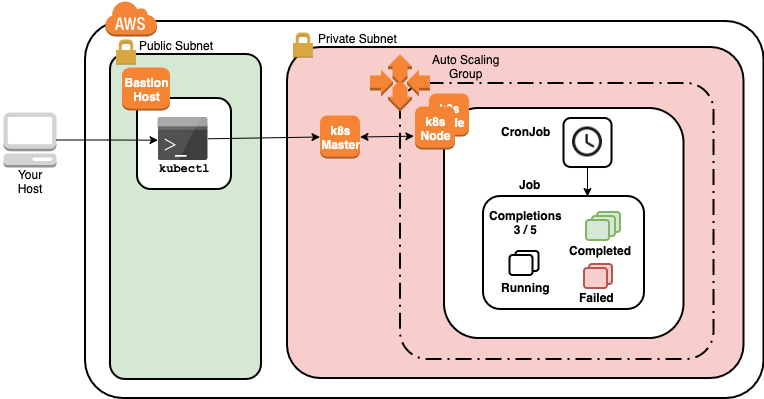

Lab Environment
---------------

You will use a multi-node Kubernetes cluster to explore jobs, and cronjobs for running batch workloads in this lab. This lab provides you with a Kubernetes cluster initialized with kubeadm and running on Ubuntu. The cluster is similar to the clusters used in official CNCF Kubernetes certification exams. It has a bastion node for connecting to the Kubernetes cluster nodes that includes a single control-plane node. The infrastructure is deployed on AWS. You can log in to AWS using the lab credentials and Open Environment link when needed.

The following instructions connect to the cluster using a web browser terminal. You can also connect using your preferred SSH client rather than the browser terminal by using the PPK (Windows) or PEM (Mac/Linux) key files in the Credentials section of this lab to connect to the bastion host's IP address which appears below the credentials once it is available.

Note: The Open Environment link to the left takes you to AWS, while the Open Development Env. link takes you to the web terminal.

1. Click Open Development Env. once you see 100% Setup completed. This connects you to the browser terminal.

2. At the login prompt enter the following credentials:
```
login: Enter ca
Password: Press enter (no password)
```
You are then presented with the shell prompt

3. Once you see Open Environment 100% Setup completed (It usually takes 1 minute from the time you start the lab). Copy the Cluster SSH command that appears at the bottom of the lab Credentials panel

4. In the browser terminal, enter the Cluster SSH command at the prompt. You are now connected to the bastion node in the cluster

5. To ensure the cluster has one available worker node (ROLES set to <none>) before proceeding to use the cluster, enter the following command to watch the cluster come up and press ctrl+c to stop watching:
```
watch kubectl get nodes
```
It usually takes 2 minutes from the time you start the lab to see a worker node join the cluster. You can proceed to the next step before seeing the worker node, but one worker node should be available before you start working with the cluster.

Note: You may see The connection to the server 10.0.0.100:6443 was refused - did you specify the right host or port? while the control plane's API server prepares to accept requests. It is not a problem and the control-plane node will appear before long.


Using Jobs to manage Pods that run to completion
------------------------------------------------

Deployments are best suited for long-running Pods that should not normally exit, such as web servers. There are other higher-level resources for Pods that perform batch work and run to completion. They are Jobs and CronJobs.

Jobs allow you to set a specific number of Pods that must run to completion. If a Pod fails, the Job will start a new Pod until the desired number of Pods reaching completion is met. Jobs can run multiple Pods in parallel. When the desired number of Pods successfully complete, the Job is complete. The Pods the Job creates are not automatically deleted allowing you to view their logs and statuses. When you are ready, you can delete the Job with kubectl and the associated Pods will be automatically deleted.

CronJobs run Jobs based on a declared schedule, similar to the Unix cron tool.

1. Create a Namespace for the resources you will create in this lab step and change your default kubectl context to use the Namespace:
```
# Create namespace
kubectl create namespace jobs
# Set namespace as the default for the current context
kubectl config set-context $(kubectl config current-context) --namespace=jobs
```

2. Create a Job named one-off that sleeps for 30 seconds:
```
kubectl create job one-off --image=alpine -- sleep 30
```
The Job will immediately start running a single Pod by default.

3. Read through the spec of the Job to see what other fields can be configured:
```
kubectl get jobs one-off -o yaml | more
```
Some important fields to highlight are:

- backoffLimit: Number of times a Job will retry before marking a Job as failed
- completions: Number of Pod completions the Job needs before being considered a success
- parallelism: Number of Pods the Job is allowed to run in parallel
- spec.template.spec.restartPolicy: Job Pods default to never attempting to restart. Instead, the Job is responsible for managing the restart of failed Pods.

Also, note the Job uses a selector to track its Pods.

4. Use explain to see what other Job spec fields can be specified:
```
kubectl explain job.spec | more
```
The activeDeadlineSeconds and ttlSecondsAfterFinished are useful for automatically terminating and deleting Jobs.

5. Create a Job that has a Pod that always fails:
```
cat << 'EOF' > pod-fail.yaml
apiVersion: batch/v1
kind: Job
metadata:
  name: pod-fail
spec:
  backoffLimit: 3
  completions: 6
  parallelism: 2
  template:
    spec:
      containers:
      - image: alpine
        name: fail
        command: ['sleep 20 && exit 1']
      restartPolicy: Never
EOF
kubectl create -f pod-fail.yaml
```
The Pod will always fail after sleeping for 20 seconds due to the exit 1 command (returning a non-zero exit code is treated as a failure). The Job allows for two Pods to run in parallel.

6. Watch the describe output for the Job to see how the Job progresses:
```
watch kubectl describe jobs pod-fail
```
Notice the Pod Statuses shows 2 Running Pods and there is always 0 Succeeded. In the Events, you can see the job-controller automatically restarts Pods as prior Pods fail. Eventually, the following event appears indicating the backoff limit was exceeded, and the Job stops retrying:

7. Press ctrl+c to stop watching the output.

8. Get the Pods in the jobs namespace:
```
kubectl get pods
```
All of the Pods associated with the Jobs you ran are listed. The Pods will remain until you delete them or the Job associated with them. Setting a Job's ttlSecondsAfterFinished can free you from manually cleaning up the Pods.

9. Create a CronJob that runs a Job every minute:
```
cat << 'EOF' > cronjob-example.yaml
apiVersion: batch/v1beta1
kind: CronJob
metadata:
  name: cronjob-example
spec:
  schedule: "*/1 * * * *"
  jobTemplate:
    spec:
      template:
        spec:
          containers:
          - image: alpine
            name: fail
            command: ['date']
          restartPolicy: Never
EOF
kubectl create -f cronjob-example.yaml
```
The CronJob spec is mainly a schedule with a template for creating Jobs (jobTemplate). There are a few other fields though. For more information about CronJob fields, issue kubectl explain cronjob.spec. To learn more about the cron schedule syntax, [see here](https://en.wikipedia.org/wiki/Cron).

10. Observe the Events of the CronJob to confirm that it is creating Jobs every minute:
```
watch kubectl describe cronjob cronjob-example
```


