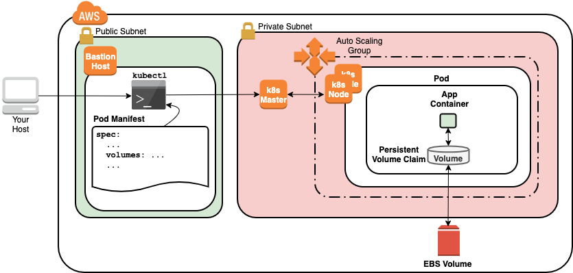

Using Persistent Data with Pods
-------------------------------

Persistent Volumes (PVs) are Kubernetes resources that represent storage in the cluster. Unlike regular Pod volumes (volumes of the default [emptyDir type](https://kubernetes.io/docs/concepts/storage/volumes/#emptydir)) which exist only during the lifetime of the Pod containing volume, PVs do not have a lifetime connected to a Pod. Thus, they can be used by multiple Pods over time, or even at the same time. Different types of storage can be used by PVs including NFS, iSCSI, and cloud-provided storage volumes, such as AWS Elastic Block Store (EBS) volumes. The list of [supported PVs is here](https://kubernetes.io/docs/concepts/storage/persistent-volumes/#types-of-persistent-volumes). Pods claim PV resources through Persistent Volume Claims (PVCs). A Pod can claim a specific amount of PV storage and an access mode, such as read/write by only one node, through a PVC. The PV will be automatically created as long as the cluster supports dynamic provisioning. This allows you to consider PVCs as storage.

The cluster you are using is running in AWS and is configured to automatically create EBS volumes when using PVCs.

1. Create a Namespace for the resources you'll create in this lab step and change your default kubectl context to use the Namespace:
  ```
  # Create namespace
  kubectl create namespace persistence
  # Set namespace as the default for the current context
  kubectl config set-context $(kubectl config current-context) --namespace=persistence
  ```

  It is a best practice to use namespaces to logically organize your Kubernetes resources.

2. Create a PVC:
  ```
  cat << 'EOF' > pvc.yaml
  kind: PersistentVolumeClaim
  apiVersion: v1
  metadata:
    name: db-data
  spec:
    # Only one node can mount the volume in Read/Write
    # mode at a time
    accessModes:
    - ReadWriteOnce
    resources:
      requests:
        storage: 2Gi
  EOF
  kubectl create -f pvc.yaml
  ```

  You will use the PVC to store data in a database, a common example of persistent data that should survive in case a Pod were to be terminated.

3. Use get to display the PVC:
  ```
  kubectl get pvc
  ```

  pvc is a kubectl alias for persistentvolumeclaim, so you don't need to type the complete Resource name. The output shows the PVC STATUS is Bound, but the output may show Pending while the underlying PV is being created. The STORAGECLASS is gp2 which is the type of automatically configured Amazon EBS volumes that are created.

4. Use get to display the underlying PV:
  ```
  kubectl get pv
  ```

  Similar information is displayed. There is a RECLAIM POLICY associated with the PV. The Delete policy means the PV is deleted once the PVC is deleted. It is also possible to keep the PV using other reclaim policies.

5. Create a Pod that mounts the volume provided by the PVC:
  ```
  cat << 'EOF' > db.yaml
  apiVersion: v1
  kind: Pod
  metadata:
    name: db
  spec:
    containers:
    - image: mongo:4.0.6
      name: mongodb
      # Mount as volume
      volumeMounts:
      - name: data
        mountPath: /data/db
      ports:
      - containerPort: 27017
        protocol: TCP
    volumes:
    - name: data
      # Declare the PVC to use for the volume
      persistentVolumeClaim:
        claimName: db-data
  EOF
  kubectl create -f db.yaml
  ```

  The Pod uses the MongoDB image, which is a NoSQL database that stores its database files at /data/db by default. The PVC is mounted as a volume at that path causing the database files to be written to the EBS Persistent volume.

6. Run the MongoDB CLI client to insert a document that contains the message "I was here" into a test database and then confirm it was inserted:
  ```
  kubectl exec db -it -- mongo testdb --quiet --eval \
  'db.messages.insert({"message": "I was here"}); db.messages.findOne().message'
  ```

  The details of the MongoDB client are not important for this Lab. The insert operation adds the document to the database and the findOne operation retrieves one document from the database. The message will allow you to verify the data is persisted even after the pod is deleted.

  **Note**: IF you see an error, re-issue the command every 15 seconds until it succeeds after the Pod is fully initialized.

7. Delete the Pod:
  ```
  kubectl delete -f db.yaml
  ```

  At this point, a regular (emptyDir) volume would be destroyed and the database files would be lost.

8. Create a new database Pod:
  ```
  kubectl create -f db.yaml
  ```

  Although the Pod is new, the Pod's spec refers to the same PVC as before.

9. Attempt to find a document in the test database:
  ```
  kubectl exec db -it -- mongo testdb --quiet --eval 'db.messages.findOne().message'
  ```

  The output confirms the data was persisted by using the PVC.
  **Note**: IF you see an error, re-issue the command every 15 seconds until it succeeds after the Pod is fully initialized.



Resources
---------

- [SI Units binary](https://physics.nist.gov/cuu/Units/binary.html)
