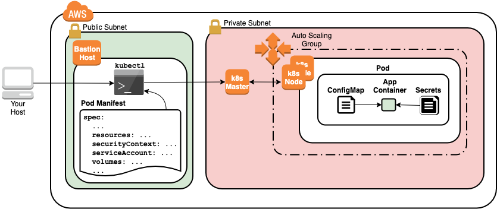

Configuring Pods using Data Stored in ConfigMaps
------------------------------------------------

ConfigMaps are a type of Kubernetes Resource that is used to decouple configuration artifacts from container image content to keep containerized applications portable. The configuration data is stored as key-value pairs. One ConfigMap may contain one or more key-value pairs. With kubectl, ConfigMaps can be created from:

- Environment variable files consisting of key-value pairs separated by equal signs, e.g. key=value. The file should have one key-value pair per line.
- Regular files or directories of files result in keys that are the names of the files and values that are the contents of the files.
- Literals consisting of individual key-value pairs that you specify on the command line.
- Writing a YAML manifest file of kind: ConfigMap.

ConfigMaps can be mounted into containers as volumes or as environment variables. Like most Kubernetes Resources, ConfigMaps are namespaced so only Pods in the same Namespace as a ConfigMap can use the ConfigMap.

1. Create a Namespace for the resources you'll create in this Lab Step and change your default kubectl context to use the Namespace:
  ```
  # Create namespace
  kubectl create namespace configmaps
  # Set namespace as the default for the current context
  kubectl config set-context $(kubectl config current-context) --namespace=configmaps
  ```

2. Create a ConfigMap from two literal key-value pairs:
  ```
  kubectl create configmap app-config --from-literal=DB_NAME=testdb \
    --from-literal=COLLECTION_NAME=messages
  ```

  The command creates one ConfigMap named app-config with two key-value pairs, DB_NAME=testdb and COLLECTION_NAME=messages.

3. Display the ConfigMap:
  ```
  kubectl get configmaps app-config -o yaml
  ```

  This is also how you would declare an equivalent ConfigMap using a manifest file passed to kubectl create -f.

4. Create a Pod that mounts the ConfigMap using a volume:
  ```
  cat << 'EOF' > pod-configmap.yaml
  apiVersion: v1
  kind: Pod
  metadata:
    name: db
  spec:
    containers:
    - image: mongo:4.0.6
      name: mongodb
      # Mount as volume
      volumeMounts:
      - name: config
        mountPath: /config
      ports:
      - containerPort: 27017
        protocol: TCP
    volumes:
    - name: config
      # Declare the configMap to use for the volume
      configMap:
        name: app-config
  EOF
  kubectl create -f pod-configmap.yaml
  ```

  The volume uses the configMap key to create a volume using a ConfigMap.

5. List the /config directory, where the ConfigMap volume is mounted, in the container:
  ```
  kubectl exec db -it -- ls /config
  ```

  The two ConfigMap keys are listed as files.

6. Get the contents of the DB_NAME file
  ```
  kubectl exec db -it -- cat /config/DB_NAME && echo
  ```

  The file content is the value of the corresponding ConfigMap key-value pair. The && echo is added simply to put the shell prompt onto a new line.

7. View more examples of creating ConfigMaps by entering:
  ```
  kubectl create configmap --help | more
  ```

To use a ConfigMap via Pod environment variables, you set the following field pod.spec.containers.envFrom.configMapRef (issue kubectl explain pod.spec.containers.envFrom.configMapRef for more details)

Storing and Accessing Sensitive Information Using Kubernetes Secrets
--------------------------------------------------------------------

Kubernetes provides Secrets as a way of storing sensitive data, such as passwords or API keys. Secrets reduce the risk of accidental exposure compared to if they were stored in an image or put in a Pod specification. Kubernetes supports storing Secrets as generic key-value pairs and also provides specialized support for TLS certificate secrets and Docker registry secrets used for pulling images from registries that require authentication. This lab step focuses on the generic variety of Secrets.

Secrets are very similar to ConfigMaps with the main difference being their intent, i.e. Secrets store sensitive information, and ConfigMaps should store configuration data. Secrets are not encrypted at rest by default and are instead only base-64 encoded. However, Kubernetes can separately control access to ConfigMaps and Secrets. So by following the pattern of storing sensitive data in Secrets, users of the cluster can be denied access to Secrets but granted access to ConfigMaps using Kubernetes access control mechanisms.

1. Create a Namespace for the resources you'll create in this lab step and change your default kubectl context to use the Namespace:
  ```
  # Create namespace
  kubectl create namespace secrets
  # Set namespace as the default for the current context
  kubectl config set-context $(kubectl config current-context) --namespace=secrets
  ```

2. Use kubectl to create a Secret named app-secret:
  ```
  kubectl create secret generic app-secret --from-literal=password=123457
  ```

  The generic key-value pair Secret is assigned using the --from-literal option with an equal sign separating the key (password) from the value (123457). You can see kubectl create secret generic --help for other methods and examples for creating generic secrets.

3. Get the YAML output for the Secret you created:
  ```
  kubectl get secret app-secret -o yaml
  ```

  The data field holds all of the key-value pairs. In this case, there is only one. The key password appears as expected, but the value (MTIzNDU3) is far from "123457". That is because secret values are base-64 encoded.

  Note: When you use kubectl create secret, the value is automatically encoded. If you use kubectl create -f, and specify a resource file, you need to encode the value yourself when setting the data: mapping. See the next instruction for how to achieve this. Alternatively, you can set a stringData: mapping instead which will perform the encoding for you. See kubectl explain secret for more details about the two options.

4. Confirm the secret value is base-64 encoded by decoding it:
  ```
  kubectl get secret app-secret -o jsonpath="{.data.password}" \
    | base64 --decode \
    && echo
  ```

  The base64 command can encode/decode strings. The --decode option must be specified to decode while the behavior with no options is to encode. The final echo is used to add a new line to the output so the shell prompt is on its own line.

5. Create a Pod that uses the Secret through an environment variable:
  ```
  cat << EOF > pod-secret.yaml
  apiVersion: v1
  kind: Pod
  metadata:
    name: pod-secret
  spec:
    containers:
    - image: busybox:1.30.1
      name: busybox
      args:
      - sleep
      - "3600"
      env:
      - name: PASSWORD      # Name of environment variable
        valueFrom:
          secretKeyRef:
            name: app-secret  # Name of secret
            key: password     # Name of secret key
  EOF

  kubectl create -f pod-secret.yaml
  ```

  When using a secret through an environment variable, you must include valueFrom.secretKeyRef to specify the source of the environment variable.

6. Print the value of the environment variable in the Pod's container:
  ```
  kubectl exec pod-secret -- /bin/sh -c 'echo $PASSWORD'
  ```

  Notice that the value is base-64 decoded automatically, so there is no need to use base64 --decode inside the container.


