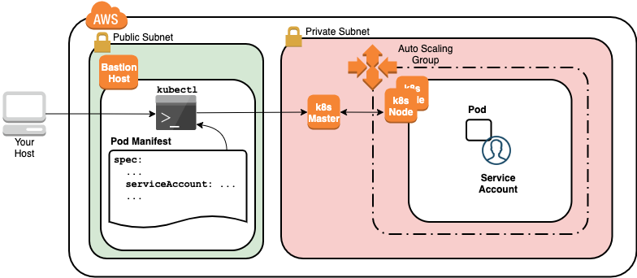

Using Kubernetes ServiceAccounts
--------------------------------

Kubernetes uses ServiceAccounts as a mechanism for providing Pods with an identity in the cluster. Pods can authenticate using ServiceAccounts and gain access to APIs that the ServiceAccount has been granted. Your cluster administrator can create specific roles that grant access to APIs and bind the roles to ServiceAccounts. This is referred to as role-based access control (RBAC). Pods can then declare a ServiceAccount in their specification to gain the access associated with the ServiceAccount's role. As an example, you could use a ServiceAccount to grant a Pod access to the GET Pod API to allow the Pod to get the details of other Pods. This lab step focuses on ServiceAccounts and not the roles that are used to grant access to Kubernetes APIs that would be configured by a Kubernetes administrator.

1. Create a Namespace for the resources you'll create in this lab step and change your default kubectl context to use the Namespace:
  ```
  # Create namespace
  kubectl create namespace serviceaccounts
  # Set namespace as the default for the current context
  kubectl config set-context $(kubectl config current-context) --namespace=serviceaccounts
  ```

2. Get the ServiceAccounts in the Namespace:
  ```
  kubectl get serviceaccounts
  ```

  Each Namespace has a default ServiceAccount. The default ServiceAccount grants minimal access to APIs and cannot be used to get any cluster state information. Therefore, you should use custom ServiceAccounts when your application requires access to cluster state.

3. Create a Pod and get its YAML manifest:
  ```
  kubectl run default-pod --image=mongo:4.0.6
  kubectl get pod default-pod -o yaml | more
  ```

  Observe the spec.serviceAccount is automatically set to the default ServiceAccount. To configure a Pod's ServiceAccount you can set the spec.serviceAccount when a Pod is created.

4. Create a new ServiceAccount:
  ```
  kubectl create serviceaccount app-sa
  ```

  It is a best practice to create a ServiceAccount for each of your applications to use the least amount of access necessary (principle of least privilege) to improve security. The created ServiceAccount will not have any specific role bound to it so there are no additional permissions associated with it. In practice, your Kubernetes administrator would create a role and bind it to the ServiceAccount.

5. Create a new Pod that uses the custom ServiceAccount:
  ```
  cat << 'EOF' > pod-custom-sa.yaml
  apiVersion: v1
  kind: Pod
  metadata:
    name: custom-sa-pod
  spec:
    containers:
    - image: mongo:4.0.6
      name: mongodb
    serviceAccount: app-sa
  EOF
  kubectl create -f pod-custom-sa.yaml
  ```

  You could also quickly generate a similar manifest file by using the following command which uses --dry-run=client -o yaml and then customizing it to your needs: kubectl run default-pod --image=mongo:4.0.6 --serviceaccount=app-sa --dry-run=client -o yaml

6. Get the Pod's YAML manifest:
  ```
  kubectl get pod custom-sa-pod -o yaml | more
  ```

  The output confirms the app-sa ServiceAccount is being used. Every ServiceAccount has a corresponding token secret (see them with kubectl get secrets) that can be used to authenticate requests from inside the container. The ServiceAccount's token secret is automatically mounted as a volume. That is what you see in the volumeMounts configuration.


